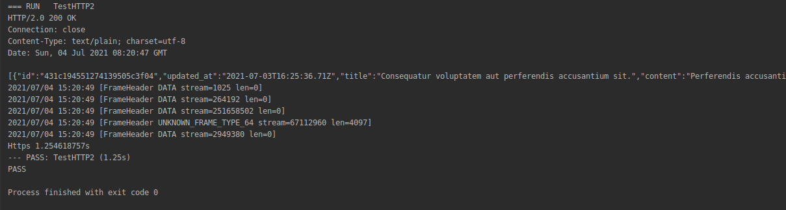

# Nâng cấp hiệu năng với http 2


###Câu hỏi:
 
 Giả sử bạn phải viết một api chia sẻ dữ liệu giữa hai module , vấn đề đặt ra làm các nào để tối ưu tốc độ trao đổi dữ liệu giữa 2 module.
 Có rất nhiều cách để giải quyết bài toán nhưng hôm nay tôi sẽ giới thiệu cách nâng cấp hiệu năng bằng protocol http 2.
 
 #### HTTP2 là gì?  
Về cơ bản thì [http2](https://developers.google.com/web/fundamentals/performance/http2/images/binary_framing_layer01.svg) là bản nâng cấp của http1 với nhiều tính năng cải tiến, nổi bật có:
- Single connection [link](https://developers.google.com/web/fundamentals/performance/http2#one_connection_per_origin)
- Server push [link](https://developers.google.com/web/fundamentals/performance/http2#server_push)
- Header compression [link](https://developers.google.com/web/fundamentals/performance/http2#header_compression)

### Giải quyết bài toán
Dựa vào tính năng Server push , tôi sẽ tối ưu tồc độ request giữa 2 module với nhau:

Đây là cấu trúc của một bài viết, database sử dụng chính là **mongodb**.
Bài toán không ràng buộc về database nên bạn có thể tuỳ chọn sử dụng một database khác cũng được:
```go 
type News struct {
	mgm.DefaultModel `bson:",inline"`
	Title            string `json:"title" faker:"sentence"`
	Content          string `json:"content" faker:"paragraph"`
	CreatedAt        string `json:"created_at" faker:"date"`
	Owner            string `json:"owner" faker:"name"`
}
```
Implement Server :
```go
	// Support http2 protocol
    func PushList(ctx *gin.Context) {
    	if !(ctx.Request.ProtoMajor == 2) {
    		ctx.JSON(400, Response{"message": fmt.Sprintf("not support http %d", ctx.Request.ProtoMajor)})
    		return
    	}
    	b := &Body{PerPage: 1}
    	err := ctx.Bind(b)
    	if err != nil {
    		log.Println(err)
    		ctx.JSON(400, Response{"message": "not support http 2"})
    		return
    	}
    	for b.Page >= 0 {
    		buf, err := getData(b)
    		if err != nil {
    			ctx.JSON(500, Response{"message": err})
    			return
    		}
    		_, _ = io.Copy(CustomWriter{w: ctx.Writer}, buf)
    		ctx.Writer.Flush()
    		b.Page--
    	}
    
    }

```

Implement Client:

```go
func Post(url string, buf *bytes.Buffer) {
	transport := &http2.Transport{DialTLS: dialT(buf), TLSClientConfig: &tls.Config{InsecureSkipVerify: true}}
	req, err := http.NewRequest("POST", url, buf)
	if err != nil {
		log.Fatal(err)
	}

	req.Header.Add("Content-Type", "application/json")
	client := &http.Client{Transport: transport}
	res, err := client.Do(req)
	if err != nil {
		log.Fatal(err)
	}

	defer res.Body.Close()
	//res.Write(os.Stdout)

	framer := http2.NewFramer(ioutil.Discard, buf)
	for {
		f, err := framer.ReadFrame()
		if err == io.EOF || err == io.ErrUnexpectedEOF {
			break
		}
		switch err.(type) {
		case nil:
			log.Println(f)
		case http2.ConnectionError:
			// Ignore. There will be many errors of type "PROTOCOL_ERROR, DATA
			// frame with stream ID 0". Presumably we are abusing the framer.
		default:
			log.Println(err, framer.ErrorDetail())
		}
	}
}
```

### Benchmark 
```text
Benchmark với yêu cầu  20k bản ghi
- Mỗi request trả về một bản ghi 

Cấu hình test: 1core CPU 3.6Hz Ram 16GB SSD read 530Mb/s
```

